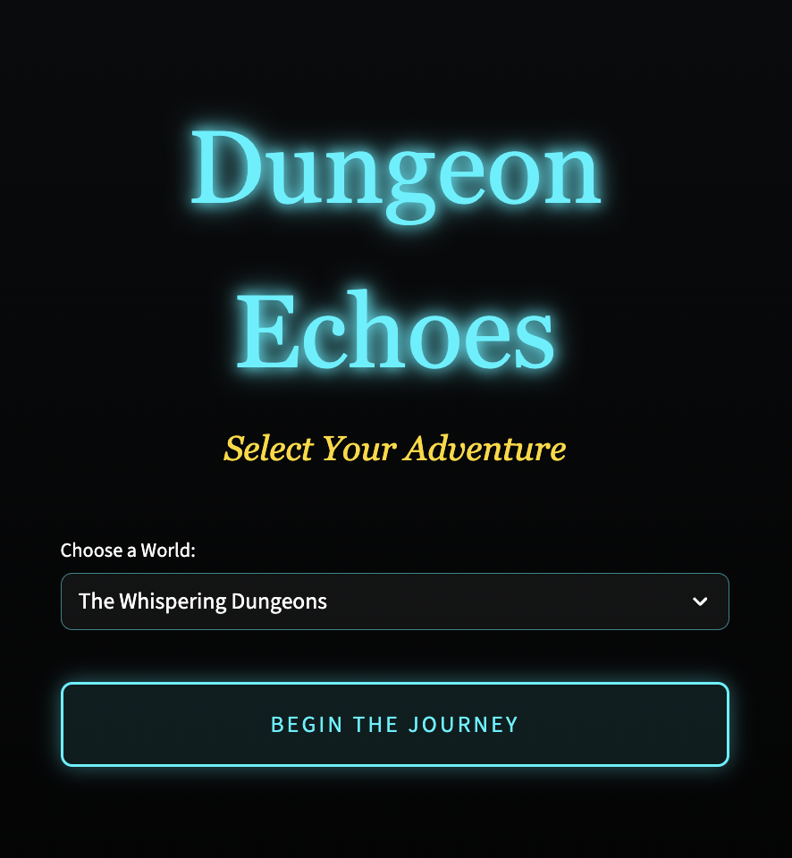
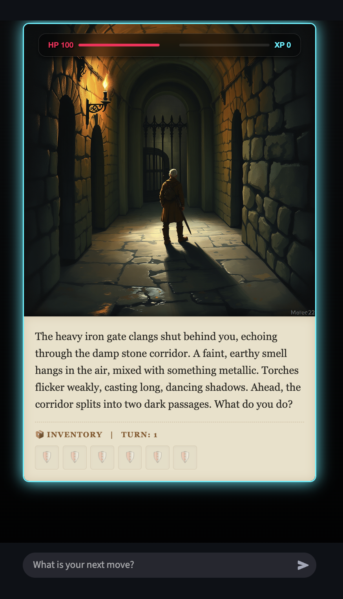

# Dungeon Echoes

A visually immersive, Dark Fantasy RPG web application where you dictate your own adventure. Powered by generative AI, Dungeon Echoes acts as your Dungeon Master, spinning an endless tale and generating real-time cinematic visuals for every move you make.





## How to Play

1. **Select Your Adventure:** Choose your starting realm from the main screen and click "Begin the Journey".
2. **Read the Scene:** The AI Dungeon Master will describe your surroundings and present a situation.
3. **Take Action:** Type whatever action you want to take into the chat box (e.g., "I strike the goblin with my sword", "I sneak past the guards", or "I search the chest"). The universe reacts to your exact words.
4. **Manage Your Fate:** Keep an eye on your Health (HP) and Experience (XP) bars at the top of the image. Your collected items will automatically appear in your Inventory grid. You must survive 15 turns to reach a victory state, but beware—if your HP drops below 0, your journey ends in defeat!

## Setup & API Keys

To run Dungeon Echoes locally, you need two API keys. You must store them in a `.env` file at the root of the project directory.

1. **GEMINI_API_KEY**: Required to power the AI Dungeon Master.
   - **Get it here:** [Google AI Studio](https://aistudio.google.com/app/apikey) (Free tier is sufficient).
2. **HF_TOKEN**: Required to generate the scene images via FLUX.1.
   - **Get it here:** [Hugging Face Settings](https://huggingface.co/settings/tokens) (Create a "Read" token for free).

**How to set them in the code:**
1. Create a new text file named exactly `.env` in the same folder as `app.py`.
2. Open the `.env` file and paste your keys in the following format (no quotes or spaces around the `=`).

```env
GEMINI_API_KEY=your_gemini_api_key_here
HF_TOKEN=your_hugging_face_token_here
```

Once the `.env` file is saved, simply run `streamlit run app.py` and the game will securely read your keys and start up!

## Tech Stack
- **Dungeon Master (LLM):** Gemini 2.5 Flash, leveraging strict JSON schema reinforcement to prevent hallucination syntax errors and narrative breakdowns.
- **Image Generation Engine:** FLUX.1 (`black-forest-labs/FLUX.1-schnell`) via Hugging Face `InferenceClient` to generate rich, atmospheric hero scene images corresponding directly to the AI's descriptive prompts.
- **Frontend Integration:** Streamlit with custom HTML/CSS for a native 450px mobile-width glassmorphism aesthetic.

## Reliability & Error Handling
- **Safety Filters:** The app uses `BLOCK_ONLY_HIGH` for Gemini settings to permit mild RPG-related conflicts and battles within the fantasy adventure bounds naturally.
- **System Recovery:** Contains explicit try/except safety nets on outputs: if the Gemini AI fails, outputs unparseable JSON, or is blocked by an overarching safety filter, the app gracefully introduces a "System Recovery Narrative" and a glitch fallback image, keeping the RPG playable without breaking the application visual stream.
- **Image Fallback:** In the event the Hugging Face Inference API drops or takes too long, Unsplash placeholders guarantee no empty visual space.

## Procedural Narrative Termination
- **Turn-based Climax:** The `app.py` script closely tracks game states natively in Python (`st.session_state.turn_count`), dynamically altering the system instructions mid-game to forcefully induce endgame states (Victory/Defeat) based on player performance and turn progression.
- **Visual Overlays:** Win/loss variables trigger CSS overlays (Golden glows for victory, crimson/dark for defeat) that lock out chat interfaces and allow users to instantly restart parallel scenarios.
## Design Philosophy
- **Diegetic UI:** The HUD elements (Health and Experience) are embedded directly onto the generated scene images as absolute-positioned, glassmorphic floating overlays, retaining player immersion by blending stats smoothly into the world illustration.
- **Unified Game Card:** The application renders the generative image and narrative output within a single continuous bordered element to mimic tabletop cards, avoiding visual fragmentation.
